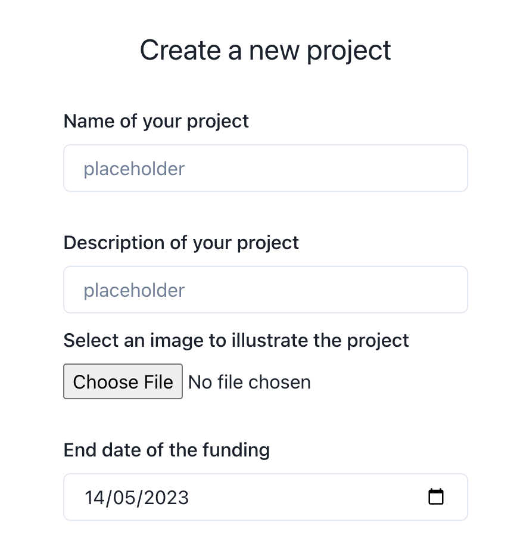
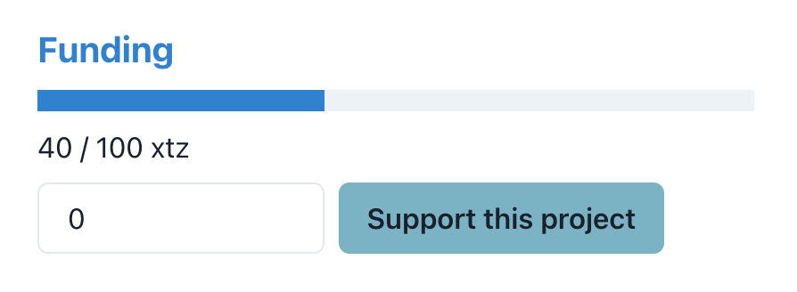

# KickSmarter 💸

## ℹ️ Description

Secure and decentralised crowdfunding platform / SDK for the future of fundraising.

## 📝 Table of Contents

- [KickSmarter 💸](#kicksmarter-)
  - [ℹ️ Description](#ℹ️-description)
  - [📝 Table of Contents](#-table-of-contents)
  - [🛠 Setup](#-setup)
  - [🚀 Deployment](#-deployment)
  - [📚 Documentation](#-documentation)
    - [1. Create a Project](#1-create-a-project)
    - [2. Fund a Project](#2-fund-a-project)
    - [3. Query](#3-query)
    - [4. Abort an unfunded project](#4-abort-an-unfunded-project)
    - [5. Claim a milestone](#5-claim-a-milestone)
    - [6. Disapprove a milestone](#6-disapprove-a-milestone)
    - [7. Abort a running project](#7-abort-a-running-project)
    - [8. Utils (IPFS related)](#8-utils-ipfs-related)


## 🛠 Setup

Clone the repo, then go to the `contracts` directory. Edit the Makefile and set the `$USERNAME` variable to your username of choice. Then run the following commands:

```bash
make config
make compile
make deploy
```

You shoold obtain something like this:

```txt
> make config

Tezos address added: [YOUR_ADDRESS]

> make compile

ligo compile contract ./contract/kicksmarter.jsligo -m Kicksmarter > ./artifacts/kicksmarter.tz
```

## 🚀 Deployment

To deploy the contract, run the following command:

```txt
> make deploy

[...TRUNCATED...]

New contract [CONTRACT_ADDRESS] originated.

[...TRUNCATED...]
```

Grab the `CONTRACT_ADDRESS` we will need it for later.

To deploy the client, you can use vercel (recommended).

Make sure to set the `NEXT_PUBLIC_CONTRACT_ADDRESS` environment variable to the `CONTRACT_ADDRESS` obtained earlier.


## 📚 Documentation

Now that the contract is deployed, you can directly use the SDK to interact with the contract. Make sure to wrap your React Application inside the `TezosProvider` and `KicksmarterProvider` components like so:

```tsx
const Wrapper = ({children}: {children: JSX.Element}): JSX.Element => (
    <TezosProvider>
        <KicksmarterProvider contractAddress={CONTRACT_ADDRESS}>
            {children}
        </KicksmarterProvider>
    </TezosProvider>
);
```

You can find a demo application in the `client` directory that uses the SDK.

### 1. Create a Project

To create a project, goto `/create` and fill the form. You will need to sign the transaction with your wallet.

- using the Client demo:



- or using the SDK:
```ts
postProject: ({
    cid_metadata,
    milestones,
    funding_due_date,
}: {
    cid_metadata: string;
    milestones: TMilestone[];
    funding_due_date: Date;
}) => Promise<void>;
```

### 2. Fund a Project

To fund a project, goto the page of the project. You will need to sign the transaction with your wallet.

- using the Client demo:



- or using the SDK:
```ts
fundProject: (project_id: number, amount: number) => Promise<void>;
```

### 3. Query

To query the projects, you can use the `getProjects` and `getProject` function.

```ts
getProjects: () => Promise<TProject[]>;
getProject: (project_id: number) => Promise<TProject>;
```

### 4. Abort an unfunded project

To abort a project with insufficient or inexistant funds you can use the `abortProjectFunding` function.

```ts
abortProjectFunding: (project_id: number) => Promise<void>;
```

### 5. Claim a milestone

To claim the amount of a milestone, you can use the `claimMilestone` function.

```ts
claimMilestone: (project_id: number, milestone_id: number) => Promise<void>;
```

### 6. Disapprove a milestone

If you are unhappy with the work done by the project owner, you can disapprove a milestone using the `disapproveMilestone` function.

```ts
disapproveMilestone: ({ project_id, milestone_id }: { project_id: number; milestone_id: number }) => Promise<void>;
```

### 7. Abort a running project

If enough people are unhappy with the project and rejected the latest `milestone`, they can vote to abort the project using the `abortProject` function.

```ts
abortProject: (project_id: number, milestone_id: number) => Promise<void>;
```

### 8. Utils (IPFS related)

To upload an image to IPFS, you can use the `pushImageToIPFS` function.

```ts
pushImageToIPFS: (image: File) => Promise<string>;
```

To upload the json of a project metadata to IPFS, you can use the `pushMetadataToIPFS` function.

```ts
pushMetadataToIPFS: ({
    title,
    description,
    images,
}: {
    title: string;
    description: string;
    images: string[];
}) => Promise<string>;
```

You can then retrieve the contents using the corresponding CIDs.

```ts
getImageFromIPFS: (cid: string) => Promise<string>;
getMetadataFromIPFS: (cid: string) => Promise<{
    title: string;
    description: string;
    images: string[];
}>;
```
